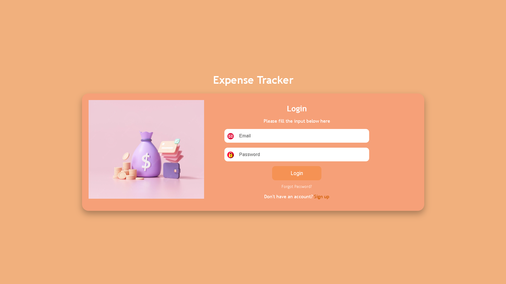
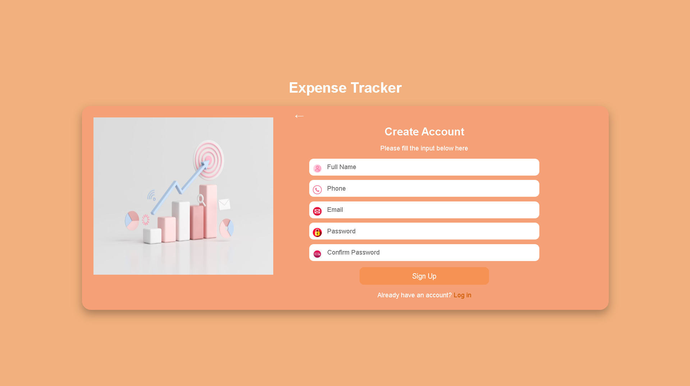
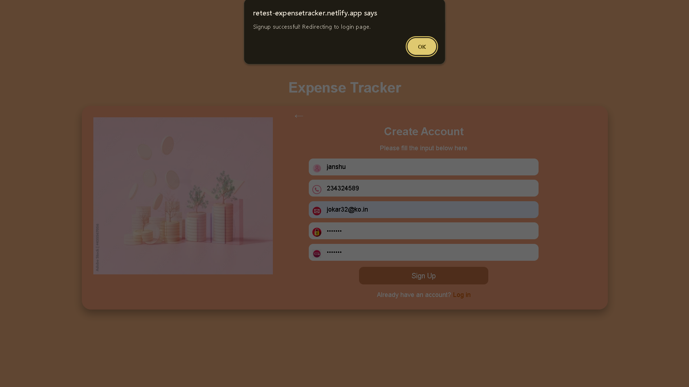
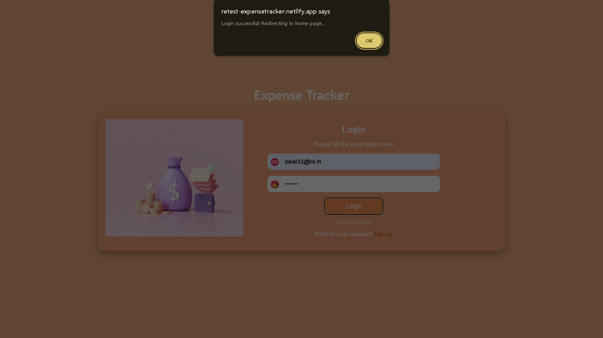
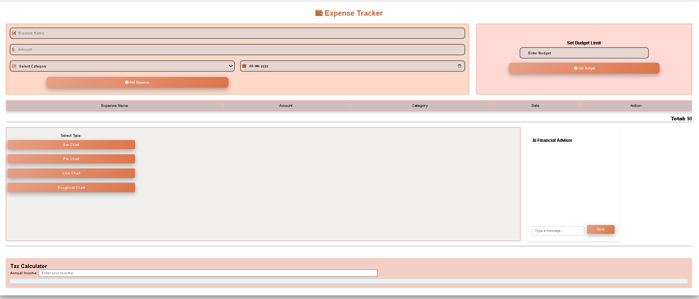
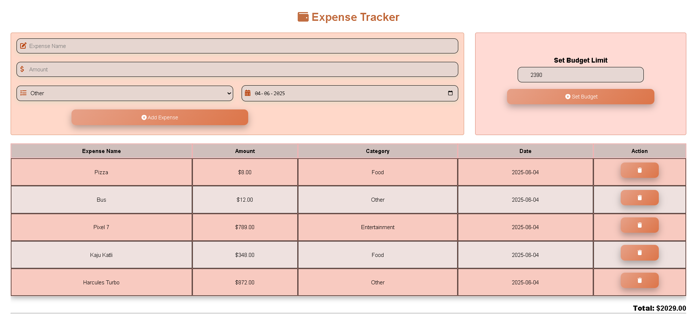
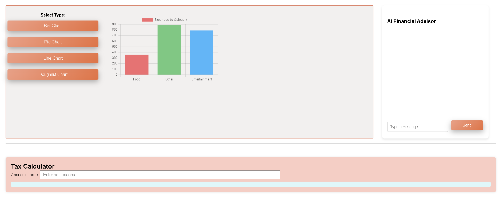

# 📊 Stock Tracker Dashboard

[](https://retest-expensetracker.netlify.app/)

Track your daily expenses like a pro! This **Stock Tracker Dashboard** is a lightweight web app built using **HTML**, **CSS**, and **JavaScript**. It enables users to **sign up**, **log in**, and **track expenses** across categories like 🍔 Food, 🚗 Transport, 🎬 Entertainment, and more — all with a simple and responsive interface.

---

## ✨ Features

* 🔐 **User Authentication**: Local sign-up and login system using `localStorage`
* 💸 **Expense Input**: Add expense name, amount, category, and date
* 📂 **Category-wise Sorting**: Group expenses into Food, Transport, Entertainment, or Other
* 📱 **Responsive Design**: Works smoothly on all screen sizes
* 🎞️ **Animated UI**: Includes beautiful animations using Anime.js
* 📊 **Expense Visualization**: (Coming Soon!) Dynamic charts using Chart.js

---

## 🛠️ Technologies Used

* 🧱 **HTML** – Page structure
* 🎨 **CSS** – Styling and layout
* ⚙️ **JavaScript** – Core logic and interactivity
* 📊 **Chart.js** – For expense graphs *(coming soon!)*
* 🎞 **Anime.js** – For smooth and aesthetic animations
* 🌐 **localStorage** – For storing user data persistently on the browser

---

## 🚀 Getting Started

Follow these simple steps to run the project locally:

### 🔧 Prerequisites

Make sure you're using a modern browser like **Chrome**, **Firefox**, or **Edge**.

### 📥 Installation

```bash
# 1. Clone the repository
git clone https://github.com/Ash-dot-coder/REMCTExpenseTracker.git

# 2. Move into the project directory
cd REMCTExpenseTracker

# 3. Launch the app by opening index.html in your browser
```

---

## ⚙️ Usage Guide

1. **Sign Up** – Fill out your full name, phone number, email, and password.
2. **Login** – Use your email and password to log in securely.
3. **Track Expenses** – Enter expense details such as name, amount, category, and date.
4. **Visualize** – *(Coming soon)* Use charts to analyze your spending habits.

---

## 🗂️ Folder Structure

```
REMCTExpenseTracker/
│
├── index.html             # Login Page
├── SignIn_form/           # Sign-Up Page
├── HomePage/              # Dashboard after login
│
├── Images/                # Asset images
├── style.css              # Global Styles
├── script.js              # Core JavaScript Logic
└── README.md              # Project Overview
```

---

## 📸 Output Screenshots









> *Replace placeholder URLs with your actual image links/screenshots hosted on GitHub or ImgBB.*

---

## 🙏 Acknowledgements

* 💡 [Chart.js](https://www.chartjs.org/) – For chart rendering
* ✨ [Anime.js](https://animejs.com/) – For animations
* 🔠 [Font Awesome](https://fontawesome.com/) – Icons used throughout the project

---